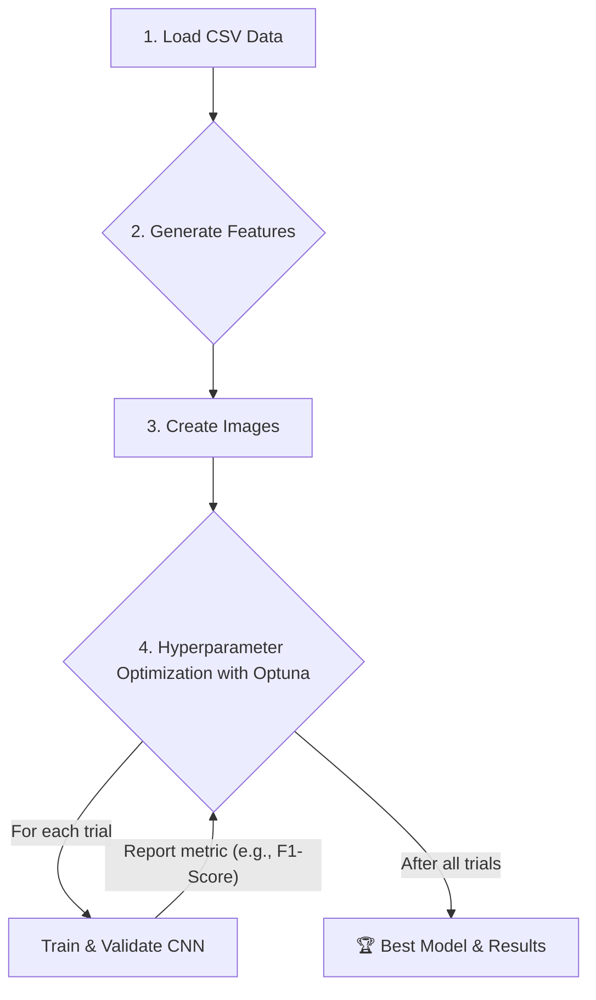

# Educational Pipeline: Image Generation & CNN Tuning with Optuna

This repository provides a clear, step-by-step educational pipeline for converting time-series data into images and using **Optuna** to find the best hyperparameters for a **PyTorch-based Convolutional Neural Network (CNN)**.

The project is designed for students and researchers who want to understand the core concepts of image-based time-series analysis and automated hyperparameter tuning without the complexity of a full-blown financial backtesting system.

---

## ✨ Core Concepts Demonstrated

* **Data-to-Image Conversion**: Transform numerical time-series data (like stock prices) enriched with technical indicators into RGB images.
* **Configuration-Driven Workflow**: Control the entire process—from feature selection to the CNN architecture—through a single, well-documented `config.yaml` file.
* **Dynamic CNN Architecture**: Define your neural network layer-by-layer directly in the configuration file.
* **Automated Hyperparameter Tuning**: Use the powerful **Optuna** framework to automatically search for the best combination of features, image parameters, and model architecture.

---

## 🚀 The Workflow

The pipeline follows a simple, linear process that is easy to understand and modify.



---

## 📂 Project Structure

The project has been simplified to its essential components:

```
./
├── configs/
│   └── base_config.yaml      # THE MOST IMPORTANT FILE: Configure everything here!
├── data/
│   └── raw/
│       └── BTC_daily_historical.csv
├── runs/                       # All outputs (models, logs, plots) are saved here
├── scripts/
│   └── run_optimization.py     # The single script to start the pipeline
└── src/                        # All the source code
    ├── data/                   # Modules for loading, features, and images
    ├── model/                  # Module for building the CNN
    ├── optimization/           # Optuna integration
    ├── training/               # Training & validation loops
    └── pipeline.py             # The main class that ties everything together
```

---

## 🛠️ Getting Started

### 1. Installation

This project uses **Conda** to manage its environment.

1.  **Clone the repository:**
    ```bash
    git clone <your-new-repo-url>
    cd <your-repo-name>
    ```

2.  **Create and activate the Conda environment:**
    The `environment.yml` file contains all required packages.

    ```bash
    conda env create -f environment.yml
    conda activate p2p_student_env
    ```

### 2. How to Run

The entire process is started with a single command.

1.  **(Optional) Configure Your Experiment**: Open `configs/base_config.yaml` and modify the `features`, `model.architecture`, or `optimization.search_space` sections to fit your research question.

2.  **Start the Optimization**:
    ```bash
    python scripts/run_optimization.py
    ```

That's it! The pipeline will now start the Optuna study. You will see the progress for each trial in your terminal.

### 3. Understanding the Results

After the run is complete, all results will be in a new, timestamped folder inside the `runs/` directory.

* `optuna_study.pkl`: The complete study object.
* `optuna_history.png`: A plot showing how the objective metric improved over the trials.
* `optuna_param_importances.png`: A plot showing which hyperparameters had the biggest impact on the outcome.
* `trial_.../`: A sub-folder for each trial, containing the specific config used, the trained model (`model.pt`), and a plot of its training history.